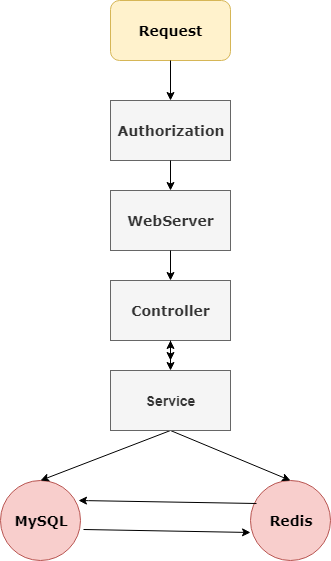
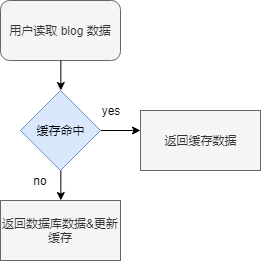

<div align="center">
    <h1>
        micoblog
    </h1>
</div>

<!-- GFM-TOC -->

* [系统架构图](#系统架构图)
* [在线演示](#在线演示)
* [缓存设计](#缓存设计)
* [安全防护](#安全防护)

## 系统架构图

<div align="center">
  
</div>


## 在线演示

[micoblog](http://120.79.82.70:8080/blog)

用户名和密码都为 test。

## 缓存设计
微博内容具有典型的读多写少的特性，特别适合对数据进行缓存。
基本的实现逻辑如下：
<div align="center">
  
</div>

##  XSS 防护
XSS 是一种网站应用程序的安全漏洞攻击，是代码注入的一种。它允许恶意用户将代码注入到网页上，其他用户在观看网页时就会受到影响。例如

```
<script> alert("hello"); </script>
```

这样的脚本如果不加防护，该脚本将会执行从而弹出窗口，影响用户体验。
防护 XSS 攻击也很简单，只需要将可能出现危险的字符转义。

```
    public static String xssFilter(String s) {
        s = s.replace("<","&lt;");
        s = s.replace(">", "&gt;");
        return s;
    }

```


